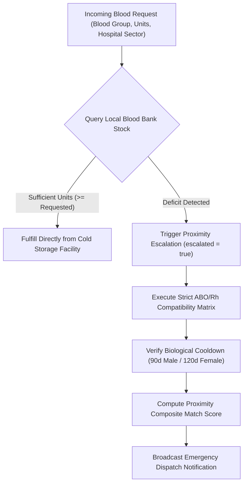
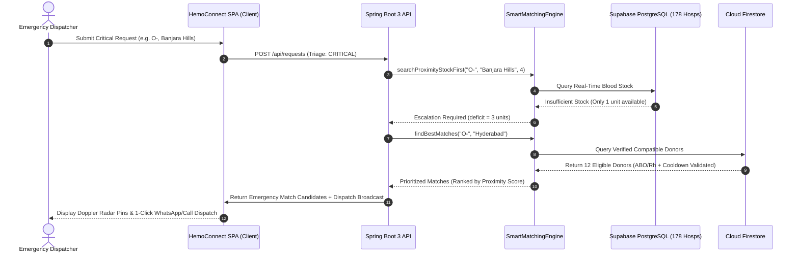

<div align="center">

# 🩸 HemoConnect
### Precision Clinical Coordination & Real-Time Immunohematology Blood Logistics

[](https://hemoconnect-22.web.app)
[](https://github.com/Rohanreddy2006/HemoConnect)

[](https://www.oracle.com/java/)
[](https://spring.io/projects/spring-boot)
[](https://supabase.com/)
[](https://firebase.google.com/)
[](https://tailwindcss.com/)
[](https://owasp.org/)
[](LICENSE)

<br/>

**A mission-critical emergency healthcare platform built to eliminate fatal delays in discovering compatible blood units and verified volunteer donors across the metropolitan hospital grid.**

[Explore Live Web App](https://hemoconnect-22.web.app) • [View API Architecture](#-rest-api-ecosystem-9-controllers) • [Supabase Clinical Grid](#-supabase-real-time-hospital-grid) • [Getting Started](#-getting-started)

</div>

---

## 📑 Table of Contents
- [Executive Summary](#-executive-summary)
- [Key Architectural Highlights](#-key-architectural-highlights)
- [Complete Implementation Journey (Parts 1–11)](#-complete-implementation-journey-parts-111)
- [Immunohematology Compatibility Engine](#-immunohematology-compatibility-engine)
- [Supabase Real-Time Hospital Grid (178 Hospitals)](#-supabase-real-time-hospital-grid-178-hospitals)
- [REST API Ecosystem (9 Controllers)](#-rest-api-ecosystem-9-controllers)
- [Cybernetic Glassmorphism UI Architecture](#-cybernetic-glassmorphism-ui-architecture)
- [Defensive Security & OWASP Hardening](#-defensive-security--owasp-hardening)
- [System Architecture & Data Flow](#-system-architecture--data-flow)
- [Project Directory Layout](#-project-directory-layout)
- [Getting Started & Local Setup](#-getting-started--local-setup)
- [Production Deployment](#-production-deployment)
- [Author & Credits](#-author--credits)

---

## ⚡ Executive Summary

During acute clinical hemorrhages, traumatic emergencies, and oncological procedures, **every second counts**. In metropolitan healthcare ecosystems, blood banks and hospitals operate in silos. Emergency dispatchers are forced to make manual telephone queries across unverified registries, resulting in tragic supply delays.

**HemoConnect** revolutionizes emergency transfusion workflows by introducing:
1. **Stock-First Proximity Escalation**: Prioritizes existing cold-storage blood units within nearest hospital facilities before issuing civic broadcasts.
2. **Automated Emergency Dispatch**: Dynamically triggers multi-channel donor alerts when local stock is exhausted.
3. **Strict ABO/Rh Immunohematology Validation**: Algorithms enforce red-cell antigen compatibility rules and biological recovery intervals to safeguard recipients.
4. **Decentralized Hospital Data Grid**: Direct synchronization with **178 verified hospitals across 49 Greater Hyderabad sectors** powered by **Supabase PostgreSQL** with Row-Level Security (RLS).
5. **Cybernetic Glassmorphic UI**: High-contrast, real-time single-page dashboard featuring a 3D Doppler Bio-Radar and mathematical Rose Four curves.

---

## 🚀 Key Architectural Highlights

```
┌──────────────────────────────────────────────────────────────────────────────────┐
│                             HEMOCONNECT CORE PLATFORM                            │
├─────────────────────┬───────────────────────────┬────────────────────────────────┤
│ 🩸 Immunohematology │ 🏥 178+ Supabase Clinics  │ ⚡ Real-Time Emergency Engine  │
│ Strict ABO/Rh rules │ 49 Hyderabad sectors with │ Auto-escalation from facility  │
│ and biological gap  │ live inventory tracking & │ stock to voluntary registry    │
│ validation engine   │ RLS mutation gates        │ multi-node broadcast           │
├─────────────────────┼───────────────────────────┼────────────────────────────────┤
│ 🛡️ OWASP Hardened   │ 🌐 Dual Persistence       │ 🎨 Cybernetic Glassmorphic     │
│ Jsoup XSS filter,   │ Supabase PostgreSQL +     │ Deep space dark mode with      │
│ Token-bucket rate   │ Firebase Cloud Firestore  │ 3D Doppler radar and reactive  │
│ limiting & CSP auth │ + thread-safe in-memory   │ mathematical Rose Four curves  │
└─────────────────────┴───────────────────────────┴────────────────────────────────┘
```

---

## 🌟 Complete Implementation Journey (Parts 1–11)

### 📦 Part 1: Architecture Blueprint & Domain Specifications
- Established production project baseline leveraging **Java 21 LTS** and **Spring Boot 3.3.0**.
- Defined strict immunohematology protocols, data privacy standards, and zero-trust domain boundaries.

### 🧬 Part 2: Clinical Domain Modeling (`com.hemoconnect.model`)
- **`Donor`**: Comprehensive donor profile tracking biological parameters (age, weight, hemoglobin $\ge 12.5\text{ g/dL}$, systolic/diastolic blood pressure, pulse) and automated eligibility cooldown timers (90 days for males, 120 days for females).
- **`BloodRequest`**: Triage-classified blood requirement entity (`ROUTINE`, `URGENT`, `CRITICAL`), target facility, units required, and lifecycle fulfillment states (`PENDING`, `MATCHED`, `FULFILLED`).
- **`BloodBank`**: Regional facility model with geospatial coordinates, contact directories, and real-time stock matrix `Map<String, Integer>`.
- **`Hospital`**: Institutional entity tracking clinical accreditation, sector location, and credentialed API access keys (HAK).
- **`Notification`**: Emergency broadcast payloads routed across recipient nodes.
- **`Admin`**: Governance and audit entity with elevated oversight privileges.

### 🧪 Part 3: Smart ABO/Rh Compatibility Engine & Input Sanitizer
- **`SmartMatchingEngine`**: Encapsulates immunohematology rules, calculating composite match coefficients based on antigen compatibility, geospatial Haversine distance, and donor availability.
- **`searchProximityStockFirst`**: First queries local hospital refrigerators; automatically raises `escalated = true` when reserves fall below clinical demand.
- **`InputSanitizer`**: Enforces strict Jsoup `Safelist.none()` cleaning on all inbound strings to eliminate XSS, HTML injection, and polyglot payloads.

### ⚙️ Part 4: Clinical Services & Centralized Exception Handling
- **`DonorService`**: Manages voluntary donor registration with automated biological validation (enforcing ages 18–65 and weight $\ge 50\text{ kg}$).
- **`BloodRequestService`**: Triage coordinator orchestrating real-time stock searches and emergency notifications for `CRITICAL` requests.
- **`NotificationService`**: Event-driven alert publisher for urgent transfusion dispatches.
- **`GlobalExceptionHandler` (`@RestControllerAdvice`)**: Centralized fault barrier translating JSR-380 bean validations, JSON schema violations, and unhandled exceptions into RFC-7807 compliant error responses while shielding internal stack traces.

### ☁️ Part 5: Dual-Mode Cloud Firestore Persistence
- **`FirebaseConfig`**: Manages Google Cloud service credentials, connection pooling, and connection lifecycles.
- **`FirebaseService`**: Implements hybrid persistence:
  - *Production Cloud Mode*: Direct bidirectional reads/writes to Google Cloud Firestore collections (`donors`, `requests`, `bloodbanks`, `hospitals`).
  - *Zero-Dependency Fallback*: In-memory `ConcurrentHashMap` database pre-seeded with clinical demo entities for instant sandbox testing.
- **`blood_banks_data.json`**: Pre-configured regional dataset containing Greater Hyderabad blood banks and hospital facilities.

### 🔍 Part 6: National Registry Web Scraper & Clinical Analytics
- **`VoluntaryRegistryScraper`**: High-resilience Jsoup scraper querying voluntary blood donor registries with configurable timeouts, header masquerading, and fault-tolerant DOM parsers.
- **`AnalyticsService`**:
  - *Shortage Forecasting*: Identifies blood groups falling under critical thresholds ($\le 5$ units).
  - *Spatial Demand Heatmap*: Aggregates consumption metrics across municipal sectors.
  - *Turnaround Telemetry*: Evaluates emergency dispatch-to-fulfillment cycle durations.

### 🛡️ Part 7: REST API Ecosystem & OWASP Hardening
- Complete suite of **9 Spring Boot Controllers** spanning donors, requests, stock, facilities, emergency dispatches, analytics, system configuration, admin, and health tips.
- **`SecurityConfig`**: Spring Security with stateless sessions, CSRF protection, and strict endpoint authorization gates.
- **`RateLimitingFilter`**: Sliding-window token bucket filter mitigating enumeration and DoS attempts.
- **`WebConfig`**: Restrictive CORS configuration guarding against cross-origin API abuse.

### 💻 Part 8: Cybernetic Glassmorphic Frontend SPA
- Single-page application built on a modern **dark cybernetic aesthetic** (`#070A13` background, translucent backdrop-filter glass cards, Crimson `#E11D48` & Data Cyan `#06B6D4` accents).
- **Interactive 3D Doppler Bio-Radar**: Radial radar visualizer plotting candidates by proximity and blood group compatibility.
- **Mathematical Rose Four Loader**: Animated geometric curve overlay executing $r = (a + 0.6s)(0.72 + 0.28s)\cos(4\theta)$.
- **Containerization**: Optimized multi-stage `Dockerfile` running Spring Boot on OpenJDK 21 Alpine.

### 🏥 Part 9: Supabase PostgreSQL Integration (178 Hospitals)
- Engineered `supabase_schema.sql` supporting **178 verified hospitals across 49 Greater Hyderabad sectors**.
- Enabled Row-Level Security (RLS) for public reads and credentialed hospital edits.
- Client-side live search and sector filtering with dynamic inventory editing modals.

### 🤖 Part 10: Clinical AI Demand Prediction & Production Security
- **`ai.js`**: Heuristic clinical triage algorithm estimating unit requirements based on patient vitals and trauma conditions.
- Strict Content Security Policy (CSP), subresource integrity, and environment variable shielding.

### 📊 Part 11: Presentation Deck & Scientific Conference Poster
- **`presentation.html`**: Interactive full-screen pitch deck designed for hackathon judges and medical committees.
- **`poster.html`**: Print-ready, high-resolution scientific poster showcasing architecture, clinical workflow, and scalability telemetry.

---

## 🩸 Immunohematology Compatibility Engine

The immunohematology engine enforces strict red blood cell (RBC) antigen rules to prevent fatal acute hemolytic transfusion reactions:

| Recipient Blood Group | Compatible Donor Red Blood Cells | Universal Status |
| :---: | :---: | :---: |
| **$O^-$** | $O^-$ | **Universal RBC Donor** ($O^-$ can donate to all) |
| **$O^+$** | $O^-$, $O^+$ | — |
| **$A^-$** | $O^-$, $A^-$ | — |
| **$A^+$** | $O^-$, $O^+$, $A^-$, $A^+$ | — |
| **$B^-$** | $O^-$, $B^-$ | — |
| **$B^+$** | $O^-$, $O^+$, $B^-$, $B^+$ | — |
| **$AB^-$**| $O^-$, $A^-$, $B^-$, $AB^-$ | — |
| **$AB^+$**| $O^-$, $O^+$, $A^-$, $A^+$, $B^-$, $B^+$, $AB^-$, $AB^+$ | **Universal Recipient** ($AB^+$ can receive from all) |

### Algorithmic Triage Sequence



---

## 🏥 Supabase Real-Time Hospital Grid (178 Hospitals)

HemoConnect maintains a live PostgreSQL directory in **Supabase** spanning all major administrative zones in Greater Hyderabad:

<details>
<summary><b>📍 View Supported Greater Hyderabad Sectors (49 Sectors)</b></summary>

- **Central Hyderabad**: Banjara Hills, Jubilee Hills, Somajiguda, Punjagutta, Begumpet, Lakdikapul, Nampally, Himayatnagar, Abids, Basheerbagh
- **Secunderabad**: Paradise, Trimulgherry, Marredpally, Alwal, Bowenpally, Malkajgiri, Sainikpuri
- **Cyberabad / Hitec Corridor**: Hitec City, Gachibowli, Madhapur, Kondapur, Financial District, Nanakramguda, Raidurg, Hafeezpet
- **Kukatpally & North-West**: KPHB Colony, Nizampet, Miyapur, Bachupally, Pragathi Nagar, Chanda Nagar
- **Old City / Charminar**: Afzal Gunj, Charminar, Malakpet, Santosh Nagar, Chandrayangutta, Falaknuma, Bahadurpura
- **East Zone**: Dilsukhnagar, LB Nagar, Kothapet, Nagole, Uppal, Habsiguda, Tarnaka, Ramanthapur, Boduppal, Ghatkesar, Secunderabad Cantonment

</details>

### Live Management Features:
- **Instant Sector Filtering**: Filter across all 49 sectors with zero reload lag.
- **Full-Text Facility Search**: Match hospital names, locations, and phone numbers in real time.
- **Live Inventory Editor Modal**: Authenticated hospital staff can adjust blood stock counts on the fly.
- **One-Click Google Maps Routing**: Direct turn-by-turn navigation link to emergency room coordinates.

---

## 🌐 REST API Ecosystem (9 Controllers)

All endpoints run on port `8080` (or root in production) and produce standardized JSON:

| Controller | Route | HTTP Method | Description |
| :--- | :--- | :---: | :--- |
| **`DonorController`** | `/api/donors` | `GET` / `POST` | List registered donors; enroll voluntary donor with biological checks |
| | `/api/donors/{id}` | `GET` | Retrieve clinical donor record |
| **`BloodRequestController`**| `/api/requests` | `GET` / `POST` | List open requests; submit routine or emergency blood requirement |
| | `/api/requests/{id}/fulfill` | `PUT` | Mark request fulfilled by clinical node |
| **`BloodBankController`** | `/api/bloodbanks` | `GET` | List facilities and query real-time stock levels |
| | `/api/bloodbanks/{id}/stock` | `PUT` | Mutate inventory counts for specific blood types |
| **`HospitalController`** | `/api/hospitals` | `GET` / `POST` | Directory querying and new clinical facility registration |
| **`EmergencyController`** | `/api/emergency/dispatch` | `POST` | Trigger multi-facility emergency alarm and candidate notification |
| **`AnalyticsController`** | `/api/analytics/shortages` | `GET` | Real-time shortage forecast and critical threshold warnings |
| | `/api/analytics/summary` | `GET` | System-wide statistics and fulfillment velocity |
| **`AdminController`** | `/api/admin/metrics` | `GET` | Root system monitoring, audit logs, and cache purges |
| **`ConfigController`** | `/api/config` | `GET` | Runtime client environment parameters (Supabase / Firebase configs) |
| **`HealthTipsController`** | `/api/healthtips` | `GET` | Evidence-based donor preparation and post-donation recovery guidelines |

---

## 🎨 Cybernetic Glassmorphism UI Architecture

The frontend interface combines clinical precision with futuristic cyberpunk glass aesthetics:

```
┌────────────────────────────────────────────────────────────────────────┐
│                              DESIGN TOKENS                             │
├───────────────────┬───────────────────┬────────────────────────────────┤
│ Canvas Surface    │ #070A13           │ Deep obsidian bio-space        │
│ Glass Surface     │ rgba(30, 41, 59)  │ 40% opacity with backdrop-blur │
│ Primary Accent    │ #E11D48           │ Clinical arterial crimson      │
│ Telemetry Cyan    │ #06B6D4           │ Data streams & sector radar    │
│ Success Green     │ #00E5FF / #10B981 │ Active node & verified status  │
│ Headline Font     │ Sora              │ Clean high-readability headers │
│ Telemetry Font    │ JetBrains Mono    │ Precise medical coordinates    │
└───────────────────┴───────────────────┴────────────────────────────────┘
```

### Key UI Components:
1. **Interactive Doppler Bio-Radar**: Radial radar HUD with rotating beam that dynamically projects donor coordinates based on selected blood group compatibility.
2. **Rose Four Loader**: Pure SVG parametric curve animation displaying live harmonic equations during database replication events.
3. **Floating Blood Particles Canvas**: Lightweight 60fps HTML5 canvas rendering floating red biological cells with subtle depth parallax.
4. **Mobile Responsive Off-Canvas Drawer**: Smooth touch drawer ensuring full functionality on mobile devices for emergency paramedics in the field.

---

## 🛡️ Defensive Security & OWASP Hardening

HemoConnect adheres strictly to OWASP secure coding best practices:

- **XSS Immunization**: All user strings pass through `InputSanitizer` before reaching controllers or databases.
- **Sliding-Window Rate Limiter**: `RateLimitingFilter` enforces a 60 requests/minute ceiling per IP to thwart denial-of-service and automated donor data harvesting.
- **Stateless Authorization**: Zero server-side session state; authenticated requests validate against cryptographic Firebase/Supabase JWT tokens.
- **Strict Content Security Policy**: Disallows unauthorized inline scripts, restricting outbound connections to verified clinical infrastructure.
- **Row-Level Security (RLS)**: PostgreSQL tables are locked with cryptographic policies, granting modification rights exclusively to authenticated hospital nodes.

---

## 🏛️ System Architecture & Data Flow



---

## 📂 Project Directory Layout

```
HEMOCONNECT/
├── Dockerfile                                      # Multi-stage production container build
├── firebase.json                                   # Firebase Hosting routing & cache configuration
├── .firebaserc                                     # Firebase project target binding
├── pom.xml                                         # Maven dependency declarations (Java 21, Spring Boot 3)
├── presentation.html                               # Interactive judge presentation slide deck
├── poster.html                                     # High-res scientific conference poster
├── supabase_schema.sql                             # PostgreSQL DDL schema & 178 hospital records
├── README.md                                       # Master project documentation
└── src/
    └── main/
        ├── java/com/hemoconnect/
        │   ├── HemoConnectApplication.java         # Spring Boot bootstrap application entrypoint
        │   ├── config/
        │   │   ├── FirebaseConfig.java             # Firebase Admin SDK & connection initialization
        │   │   ├── RateLimitingFilter.java         # Token bucket sliding-window rate limiter
        │   │   ├── SecurityConfig.java             # Spring Security OWASP access rules
        │   │   └── WebConfig.java                  # CORS origin policies & filter registration
        │   ├── controller/                         # Spring Boot REST API Controllers (9 Endpoints)
        │   │   ├── AdminController.java            # System telemetry & admin controls
        │   │   ├── AnalyticsController.java        # Inventory shortage forecasting
        │   │   ├── BloodBankController.java        # Blood bank stock mutation APIs
        │   │   ├── BloodRequestController.java     # Blood request lifecycle management
        │   │   ├── ConfigController.java           # Client runtime environment parameters
        │   │   ├── DonorController.java            # Donor registration & biological queries
        │   │   ├── EmergencyController.java        # High-priority triage dispatch
        │   │   ├── HealthTipsController.java       # Clinical donor guidance
        │   │   └── HospitalController.java         # Hospital directory & Supabase bridge
        │   ├── exception/
        │   │   └── GlobalExceptionHandler.java     # Centralized exception handler (@RestControllerAdvice)
        │   ├── model/                              # Clinical domain models
        │   │   ├── Admin.java                      # Admin user model
        │   │   ├── BloodBank.java                  # Blood bank inventory model
        │   │   ├── BloodRequest.java               # Emergency request entity
        │   │   ├── Donor.java                      # Voluntary donor clinical profile
        │   │   ├── Hospital.java                   # Healthcare institution model
        │   │   └── Notification.java               # Emergency broadcast alert model
        │   ├── service/                            # Core business logic & integrations
        │   │   ├── AnalyticsService.java           # Shortage forecasting & metric aggregation
        │   │   ├── BloodRequestService.java        # Request ingestion & emergency routing
        │   │   ├── DonorService.java               # Donor eligibility & age validation
        │   │   ├── FirebaseService.java            # Cloud Firestore dual-mode persistence
        │   │   ├── NotificationService.java        # Alert dispatch coordinator
        │   │   ├── SmartMatchingEngine.java        # Immunohematology ABO/Rh rules & proximity ranking
        │   │   └── VoluntaryRegistryScraper.java   # Jsoup national voluntary registry scraper
        │   └── util/
        │       └── InputSanitizer.java             # Defensive XSS stripping utility
        └── resources/
            ├── application.properties              # Spring Boot configuration parameters
            ├── blood_banks_data.json               # Seed dataset of Hyderabad blood banks
            └── static/                             # Cybernetic Glassmorphic Single-Page Application
                ├── css/styles.css                  # Custom cybernetic animations & glassmorphism
                ├── images/                         # Clinical assets & scene illustrations
                ├── js/                             # Client-side platform modules
                │   ├── ai.js                       # Clinical triage demand prediction
                │   ├── api.js                      # Supabase REST client (178 hospitals)
                │   ├── app.js                      # SPA router, 3D radar & UI engine
                │   └── auth.js                     # Firebase authentication & session state
                └── index.html                      # Main web application entrypoint
```

---

## ⚡ Getting Started & Local Setup

### Prerequisites
- **Java Development Kit (JDK) 21** or higher
- **Apache Maven 3.9+**
- Modern Web Browser (Chrome, Firefox, Safari, Edge)

### 1. Clone the Repository
```bash
git clone https://github.com/Rohanreddy2006/HemoConnect.git
cd HemoConnect
```

### 2. Build the Backend
```bash
mvn clean compile
```

### 3. Run the Spring Boot Server
```bash
mvn spring-boot:run
```
The server will initialize on `http://localhost:8080`.

### 4. Access the Platform
Open your browser and navigate to:
- **Application Portal**: `http://localhost:8080/`
- **Presentation Deck**: `http://localhost:8080/presentation.html`
- **Scientific Conference Poster**: `http://localhost:8080/poster.html`

---

## 🚀 Production Deployment

### Live Web Application
The single-page application is hosted globally via **Google Firebase Hosting**:
- **Production URL**: [https://hemoconnect-22.web.app](https://hemoconnect-22.web.app)

### Docker Container Deployment
To run the containerized backend in any cloud environment:
```bash
# Build the production Docker image
docker build -t hemoconnect:latest .

# Run the containerized service
docker run -d -p 8080:8080 --name hemoconnect-instance hemoconnect:latest
```

---

## 👤 Author & Credits

Designed, architected, and engineered for the hackathon by:

- **Rohan Reddy** ([@Rohanreddy2006](https://github.com/Rohanreddy2006))
- **Repository**: [https://github.com/Rohanreddy2006/HemoConnect](https://github.com/Rohanreddy2006/HemoConnect)
- **Live System**: [https://hemoconnect-22.web.app](https://hemoconnect-22.web.app)

---

<div align="center">
  <sub>Built with ❤️ for emergency healthcare workers, voluntary blood donors, and clinical teams saving lives daily.</sub>
</div>
